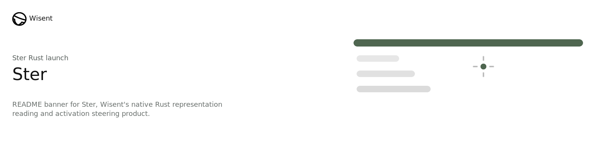

  

<!-- wisent-readme-signals:start -->

<!-- wisent-readme-signals:end -->

# Wisent: Understand and Manipulate AI Brains

  <code>pip install wisent</code>

Monitor and Control Your AI Agent Brain.

You look at what your model says. But what was it actually thinking? Wisent shows
you how to use information from AI activations, intermediate steps within its
layers, to your advantage. Wisent is a full toolkit for representation
engineering, activation steering and mechanistic interpretability. Cut
hallucination rates, decensor your model or stop it from being detected by
AI-generated text detectors. Your Models — Yours to Control. Better than
fine-tuning. Better than analysing the outputs directly.

Deploy the latest research in your stack.

## Overview

Wisent allows you to control your AI by identifying brain patterns corresponding to responses you don't like, like hallucinations or harmful outputs. We use contrastive pairs of representations to detect when a model might be generating harmful content or hallucinating. Learn more at [wisent.ai/documentation](https://www.wisent.ai/documentation).  

## License

This project is licensed under the MIT License - see the LICENSE file for details.
